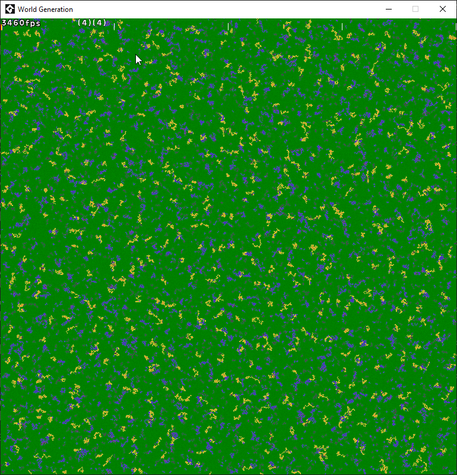

# World Generation

2D "Top Down" world generation / visualization, that was written in GML (Game Maker Studio 2.3). \
Uses [surfaces](https://manual.yoyogames.com/GameMaker_Language/GML_Reference/Drawing/Surfaces/Surfaces.htm) (To draw tiles, light), [arrays](https://manual.yoyogames.com/GameMaker_Language/GML_Overview/Arrays.htm) (To hold world information), [structs](https://manual.yoyogames.com/GameMaker_Language/GML_Overview/Structs.htm) (lightweight objects) (To implement cities, tiles structure)

### Previews

#### Size of the cell - 1 pixel, there is 1.000.000 tiles (And each may update light).

#### Movement, lighting.

